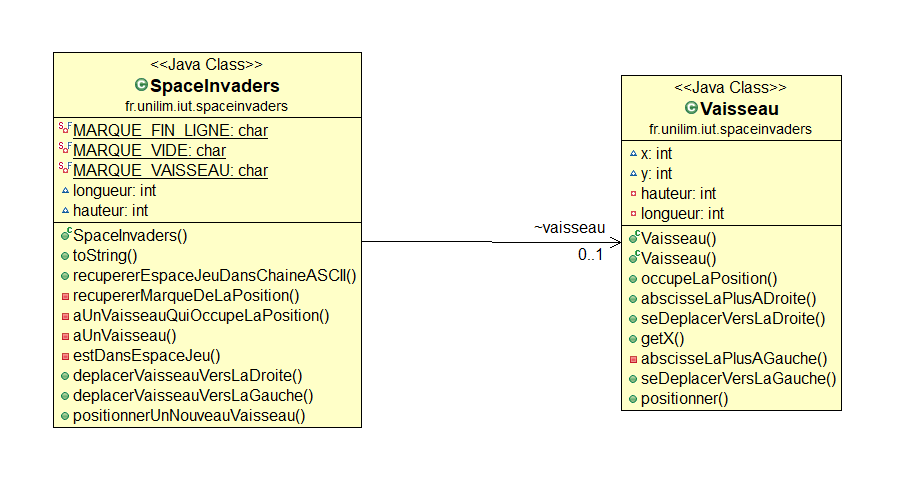

# Space Invaders

- [Semaine n°1 : du 26 au 30 avril](#semaine1) 
- [Semaine n°2 : du 10 au 15 mai](#semaine2)  
- [Semaine n°3 : du 17 au 21 mai](#semaine3)  
- [Semaine n°4 : du 24 au 28 mai](#semaine4)  
- [Glossaire](#glossaire)

## Semaine n°1 : du 26 avril au 02 mai 

### Sprints et fonctionnalités réalisées 

#### Fonctionnalité n°1 : Déplacer un vaisseau dans l'espace de jeu 

- Story n°1 : Créer un espace de jeu  
Un espace de jeu est créé aux dimensions données (2D) 
Cet espace de jeu est vide

-  Story n°2 : Positionner un nouveau vaisseau dans l’espace de jeu  
Un nouveau vaisseau est créé
Le vaisseau est positionné aux coordonnées transmises
Si un nouveau vaisseau essaye d’être positionné en dehors des limites de l’espace jeu, alors une exception devra être levée.
 Contraintes :
La position souhaitée est transmise par ses coordonnées x et y.
Le coin supérieur gauche de l’espace jeu (point en haut à gauche) a pour coordonnées (0,0)
La taille du vaisseau est réduite pour l'instant à son minimum (1 seul point)   

### Diagramme de classes (semaine n°1)  

### Nuage de mots du projet spaceinvaders (semaine n°1)  

## Semaine n°2 : du 9 mai au 16 mai 

### Sprints et fonctionnalités réalisées 

#### Fonctionnalité n°1 : Déplacer un vaisseau dans l'espace de jeu (fini)

- Story n°3 : Déplacer le vaisseau vers la droite dans l'espace de jeu
Le vaisseau se déplace d'un pas vers la droite Si le vaisseau se trouve sur la bordure droite de l'espace de jeu, le vaisseau doit rester immobile (aucun déplacement, aucune exception levée : le vaisseau reste juste à sa position actuelle).

- Story n°4 : Déplacer le vaisseau vers la gauche dans l'espace de jeu
Le vaisseau se déplace d'un pas vers la gauche Si le vaisseau se trouve sur la bordure gauche de l'espace de jeu, le vaisseau doit rester immobile (aucun déplacement, aucune exception levée : le vaisseau reste juste à sa position actuelle).

### Diagramme de classes (semaine n°2)  

### Nuage de mots du projet spaceinvaders (semaine n°2)  

## Semaine n°3 : du 17 mai au 24 mai 

### Sprints et fonctionnalités réalisées 

### Fonctionnalité 2 en cours d’implémentation : Dimensionner le vaiseau

- Story n°1 : Positionner un nouveau vaisseau avec une dimension donnée 
- Story n°2 : Faire en sorte qu'il soit impossible de positionner un nouveau vaisseau qui déborde de l'espace de jeu

### Diagramme de classes (semaine n°3)  

### Nuage de mots du projet spaceinvaders (semaine n°3)  

## Semaine n°4 : du 24 mai au 30 mai 

### Sprints et fonctionnalités réalisées 

### Fonctionnalité 2 : Dimensionner le vaiseau (fini)

- Story 3 : Déplacer un vaisseau vers la droite en tenant compte de sa dimension
- Story 4 : Déplacer un vaisseau vers la gauche en tenant compte de sa dimension

### Diagramme de classes (semaine n°4)  

### Nuage de mots du projet spaceinvaders (semaine n°3)  

### Difficultés rencontrées 
Aucune

### Remarques diverses
 Pour pouvoir, mettre en place les tests, il a été nécessaire d’ajouter une fonctionnalité supplémentaire qui permet de représenter l’espace de jeu dans une chaîne ASCII.

-------------

## Glossaire 

* **Vaisseau** :  véhicule commandé par le joueur, pouvant se déplacer de droite à gauche et ayant la possibilité de lancer des missiles destinés à détruire le(s) envahisseurs.

* **Envahisseur**  :  ennemi qui apparaît à l'écran, se déplace automatiquement et qui doit être détruit par un missile lancé depuis le vaisseau du joueur.

* **Missile** :  projectile envoyé à la verticale par le vaisseau vers l'envahisseur dans le but de le détruire.

